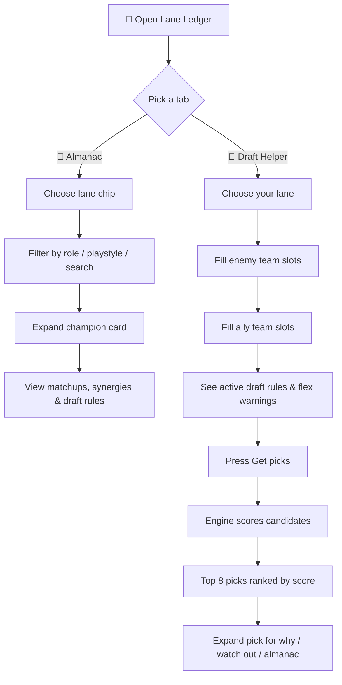
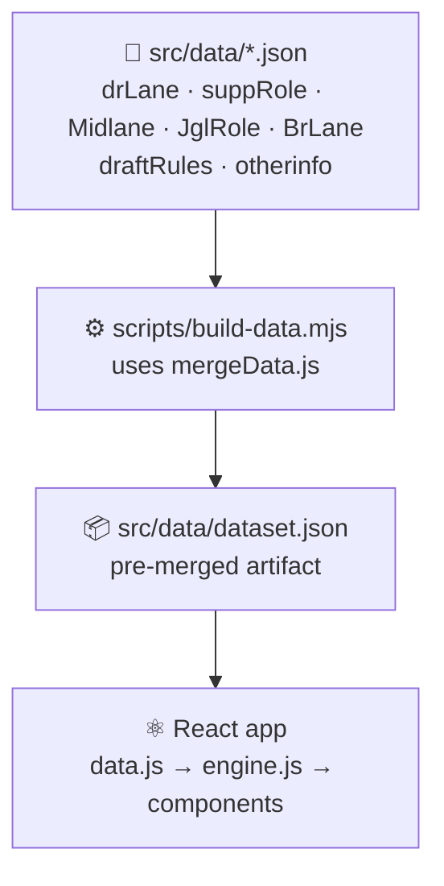

# 🎮 Lane Ledger

Offline **Wild Rift** draft companion — all 5 lanes, works on your phone with no internet. 📱⚡

Built with **React 19** + **Vite 8**. Browse the Almanac or use the Draft Helper to score pick suggestions from your current 5v5 draft.

---

## ✨ What it does

| Tab | Purpose |
| --- | --- |
| 📖 **Almanac** | Search and browse champion profiles — matchups, synergies, playstyles, and draft conditions per lane |
| 🎯 **Draft Helper** | Fill in enemy + ally picks, then get ranked recommendations with reasons and warnings |

Lanes covered: **Dragon** · **Support** · **Mid** · **Jungle** · **Baron**

---

## 🗺️ App flow



---

## 🧠 Scoring engine flow

When you hit **Get picks**, `engine.js` evaluates every eligible champion for your lane:

```mermaid
flowchart LR
    subgraph input["📥 Draft input"]
        D[Enemy picks]
        A[Ally picks]
        L[Your lane]
    end

    subgraph once["⚡ Once per request"]
        R[Evaluate draft rules]
        M[Build champion lookup Map]
    end

    subgraph perChamp["🔁 Per candidate"]
        E1[Enemy matchup score]
        E2[Reverse counter check]
        S[Ally synergy score]
        P[Playstyle fit]
        C[Pick / avoid conditions]
        DR[Matching draft rules]
    end

    input --> once
    once --> perChamp
    perChamp --> OUT[🏆 Sorted top 8 picks]
```



Score signals include direct lane counters, reverse counters, synergies, support/carry lane matchup, playstyle fit, conditional pick/avoid text, and triggered draft rules.

---

## 🏗️ Data & build pipeline

Champion data lives in JSON lane files. A build step merges them before the app loads — no runtime merge in the browser.



`npm run dev` and `npm run build` both run `build:data` automatically.

---

## 🚀 Quick start

```bash
cd lane_ledger
npm install
npm run dev        # local dev → http://localhost:5173
npm run build      # production build → dist/
npm run preview    # preview the production build
```

Deploy output is `lane_ledger/dist/` (configured in the repo root `vercel.json`).

---

## ✏️ Editing champion data

**Source of truth** — only edit files in `src/data/`. Do not hand-edit `dataset.json`.

| File | Content |
| --- | --- |
| `drLane.json` | 🐉 Dragon lane — ADC + APC |
| `suppRole.json` | 🛡️ Supports |
| `Midlane.json` | ⚔️ Mid lane |
| `JglRole.json` | 🌿 Jungle |
| `BrLane.json` | 🏰 Baron lane |
| `draftRules.json` | 📋 Draft rules & scoring logic |
| `otherinfo.json` | 🌐 Flex picks, global conditions, meta notes |

After saving JSON changes:

```bash
npm run build:data   # regenerate dataset.json only
# or
npm run build        # rebuild dataset + production bundle
```

---

## 📂 Project structure

```text
lane_ledger/
├── index.html              # App shell (SEO meta + JSON-LD)
├── public/
│   ├── favicon.svg         # App icon & header logo
│   └── sitemap.xml
├── scripts/
│   └── build-data.mjs      # Merges JSON → dataset.json
├── src/
│   ├── App.jsx             # Tabs, lane state, localStorage persist
│   ├── components/
│   │   ├── AlmanacPanel.jsx
│   │   ├── DraftPanel.jsx
│   │   ├── ChampionDetail.jsx
│   │   ├── LaneChips.jsx
│   │   └── ui.jsx
│   ├── data/               # Lane JSON + generated dataset.json
│   └── lib/
│       ├── constants.js    # Lanes, score weights, draft field defs
│       ├── data.js         # Imports pre-merged dataset
│       ├── engine.js       # Scoring, recommendations, almanac filters
│       └── mergeData.js    # JSON merge logic (build + shared)
└── vite.config.js
```

---

## 🔀 Flex champions (Akali, Yasuo, etc.)

When the same champion appears in multiple lane files, the build script merges them into **one Almanac card** with `matchupsByLane` — no duplicate entries in the UI.

---

## 🛠️ Tech stack

- ⚛️ React 19 + React Compiler
- ⚡ Vite 8
- 📦 Zero runtime dependencies beyond React
- 💾 Offline-first — all data bundled, draft state saved to `localStorage`

---

## 📄 License

MIT
